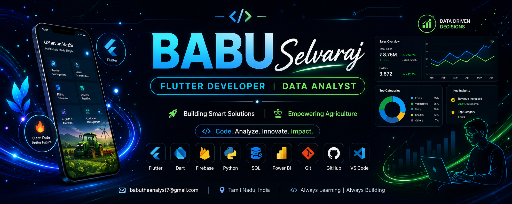

  

# 👋 Hi, I'm Babu Selvaraj

### 🚀 Flutter Developer | 📊 Data Analyst | 💻 B.Tech Information Technology

---

# 🚀 About Me

🎓 B.Tech Information Technology Graduate

📱 Passionate Flutter Developer

📊 Data Analytics Enthusiast

💡 Interested in Mobile Apps, Automation & Business Intelligence

📍 Tamil Nadu, India

---

# 🛠️ Tech Stack

## Mobile Development

## Programming

## Analytics & BI

- 📊 Power BI
- 📈 Excel
- 🗄 SQL
- 🐍 Python
- 📉 Data Visualization

---

# 🚀 Featured Projects

## 🚜 Tractor Billing Calculator (Mani Kanakku)

A Flutter application for calculating tractor work charges.

### Features

- Hour & Minute Calculation
- Multiple Entry Support
- Automatic Total Amount
- History
- Offline Usage
- Simple UI

---

## 📱 Product Listing App (Flutter)

Built using Flutter Clean Architecture.

### Features

- Product Listing
- Category Management
- Search
- Responsive UI
- BLoC Pattern

---

## 📊 Blinkit Sales & Inventory Dashboard

Power BI Dashboard with:

- Sales Analysis
- Revenue Insights
- Product Performance
- KPIs
- Interactive Charts

---

## 👨‍💼 Employee Management System

Database project developed using SQL.

### Features

- Employee Records
- Department Management
- Salary Details
- CRUD Operations

---

## 🎫 Bus Ticket Booking System

Python-based console application.

### Features

- Seat Booking
- Ticket Cancellation
- Passenger Management
- Fare Calculation

---

# 📈 GitHub Stats

---

# 🔥 Contribution Streak

---

# 🏆 GitHub Trophies

---

# 📊 Contribution Graph

---

# 💻 Skills

✅ Flutter

✅ Dart

✅ Firebase

✅ Python

✅ SQL

✅ Power BI

✅ Excel

✅ Git & GitHub

✅ Data Analytics

---

# 🎯 2026 Goals

- 📱 Publish Flutter apps on Play Store
- 📊 Build more Power BI dashboards
- 🌍 Contribute to Open Source
- 💼 Grow as a Full Stack Flutter Developer

---

# 📫 Connect With Me

📧 Email: **babutheanalyst7@gmail.com**

💼 LinkedIn: *(Add Your LinkedIn URL)*

🌐 Portfolio: *(Add Your Portfolio URL)*

---

## ⭐ Thanks for visiting my profile ⭐

